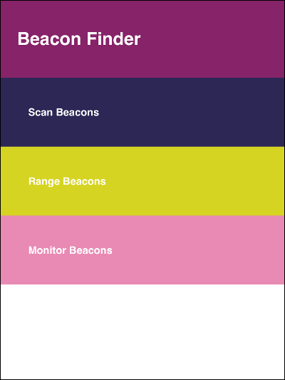

# Example application: Beacon Finder

Beacon Finder is an example app that finds and displays Estimote Beacons.

## Discovery methods

There are three methods of discovery demonstrated by the app:

* Scanning - beacon data (distance not available, uses CoreBluetooth discovery, only available on iOS)
* Ranging - beacon data including distance (uses CoreLocation ranging on iOS, available also on Android)
* Monitoring - region data (uses CoreLocation monitoring on iOS, available also on Android)

Different beacon properties are displayed depending on the method used. Monitoring displays region data.

## Screenshot

## How to build and run it?

This app has been tested with Apache Cordova. Start by installing Cordova on your computer. Installation instructions can be found in the [Cordova documentation](http://cordova.apache.org/docs/en/4.0.0/guide_cli_index.md.html#The%20Command-Line%20Interface), and the [Evothings Cordova documentation](http://evothings.com/doc/build/build-overview.html) contains detailed step-by-step instructions.

When you have installed Cordova, do the following steps to build and run the example app.

Open a command window and go to the examples/beacon-finder directory, e.g.:

    cd examples/beacon-finder

Add the Cordova whitelist plugin, this just needs to be done once:

    cordova plugin add cordova-plugin-whitelist

Add the Estimote plugin, this just needs to be done once for every update of the plugin:

    cordova plugin add https://github.com/evothings/phonegap-estimotebeacons.git

Add the platforms you wish to use (Android, iOS), this also only needs to be done once:

    cordova platform add android
    cordova platform add ios

To build and install the app on Android, use these commands:

    cordova build android
    adb install -r platforms/android/ant-build/BeaconFinder-debug.apk

To build and install the app on iOS, first build an Xcode project:

    cordova build ios

Then open and run the generated project using Xcode: platforms/ios/BeaconFinder.xcodeproj

To reinstall the plugin (update to latest version) do:

    cordova plugin rm pl.makingwaves.estimotebeacons
    cordova plugin add https://github.com/evothings/phonegap-estimotebeacons.git
